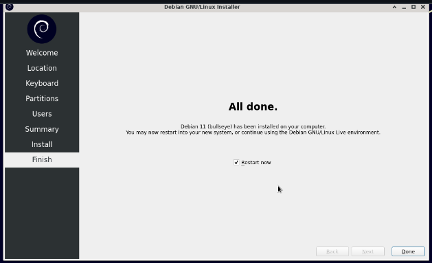

# Tutorial Instalasi Linux Debian ke Flashdisk

## Perlengkapan yang harus disiapkan:
* File iso linux
* Software untuk bootable
* 2 buah flashdisk

## Membuat Bootable Flashdisk
>## STEP 1: Download software __rufus__.

>## STEP 2: Masukkan salah satu flashdisk

Ketika sudah dimasukkan, flashdisk yang akan di bootable akan terdeteksi pada bagian Device.

>## STEP 3: Klik menu SELECT dan pilih iso Linux yang akan di bootable.

Untuk bootable kali ini saya menggunakan iso Debian 11. 
**Jangan lupa untuk menginstall iso nya terlebih dahulu.

>## STEP 4: Atur skema partisi

>## STEP 5: Klik 'Start'. Apabila muncul pop up, pilih OK/YES. Dan tunggu hingga proses selesai.

***
## Melakukan Booting dengan Flashdisk

>## STEP 1: Restart laptop kemudian pada saat layar hidup __tekan f2 sampai masuk ke menu Bios__.

 

>## STEP 2: Di pojok kanan atas (tampilan di laptop saya) pada menu boot prioritaskan flashdisk dengan memindahkan (menukarkan) posisinya ke paling atas.

 

>## STEP 3: Simpan perubahan yang tadi dilakukan kemudian keluar dari menu Bios.

***
## Instalasi Linux ke Flashdisk
>## STEP 1: Masukkan lagi flashdisk satunya yang akan diinstall linux.

Setelah berhasil booting klik enter untuk menjalankan live usb.

Klik icon install Debian, maka akan muncul pop up installer dan klik 'Next'.

>## STEP 2: Atur region waktu sesuaikan dengan waktu setempat.

>## STEP 3: Atur keyboard 'Default'.

>## STEP 4: Atur pengaturan partisi 'Manual'.

>## STEP 5: Pilih flashdisk yang menjadi tujuan instalasi.

>## STEP 6: Pilih 'New Partition Table'.

Pilih yang GPT.

Atur size partisi 500 Mib, file system fat32, mount point /boot/efi, dan flags centang yang boot.

Creat partition lagi untuk file system. 
Atur size partisi 28836 Mib, file system ext4, mount point /, dan flags centang yang root.

>## STEP 7: Atur user dan password kemudian Klik 'Next'.

>## STEP 8: Klik 'Install'.

Tunggu sampai proses install selesai.

Setelah selesai klik 'Done', maka laptop otomatis akan reboot. Kemudian cabut flashdisk bootable (flashdisk pertama). 
Maka proses instalasi sudah selesai.

