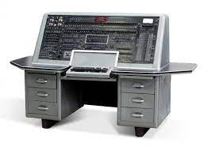
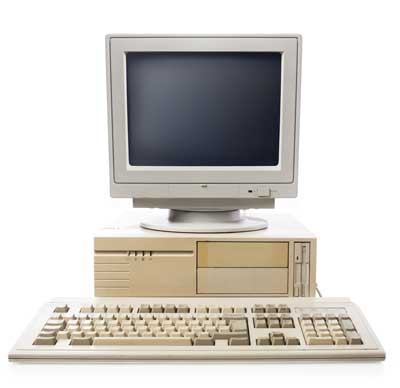
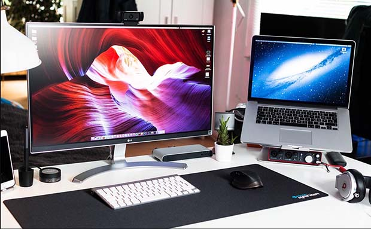

# Tugas Laporan 1
### NAMA: RISMA WULANDARI
### NIM : 2110131220008
***
>Deskripsikan terkait Benda-benda berikut yang ada pada PC/Laptop kalian, baik secara umum, spesifikasi, manfaat/kegunaan! (PC/Laptop, Sistem Operasi, Prosesor, Software, hardware, penyimpanan )

* Spesifikasi Laptop yang Saya Gunakan
    
    * Merk : Asus
    * Device name : DESKTOP-B8AOTR0
    * Processor : Intel(R) Core(TM) i3-7100U CPU @ 2.40GHz   2.40 GHz
    * Installed RAM : 4,00 GB (3,88 GB usable)
    * Hdd : 1 TB
    * Vga : Intel Hd Graphics 620
    * Device ID : CCF88654-A848-4F49-9EFE-12C8639F9525
    * Product ID : 00327-30559-87575-AAOEM
    * System type : 64-bit operating system, x64-based processor
    * Pen and touch : No pen or touch input is available for this display
    * OS : Windows 10, 64 bit

* Sistem operasi adalah perangkat lunak pada lapisan pertama yang ditempatkan pada memori komputer pada saat komputer dinyalakan booting. Sedangkan software-software lainnya dijalankan setelah sistem operasi berjalan, dan sistem operasi akan melakukan layanan inti untuk software-software tersebut. Ada cukup banyak sistem operasi yang tersedia sekarang, namun ada tiga sistem operasi komputer yang umum digunakan yaitu Windows, Mac OS X, dan Linux. Untuk laptop saya sendiri menggunakan OS Windows versi 10.

>Eksplorasi sejarah perkembangan komputer!

## Sejarah Perkembangan Komputer
Pesatnya teknologi informasi dan komunikasi (TIK) saat ini tidak lepas dari penemuan komputer yang membuat perubahan besar dalam peradaban manusia. Secara garis besar, sejarah perkembangan komputer terbagi dalam lima generasi, yaitu:

## 1. Komputer Generasi Pertama (1940-1959)
    Dimulai ketika komputer digunakan dalam akademi dan militer, seperti Komputer Atanasoff-Berry dibuat pada tahun 1937 untuk menyelesaikan sistem persamaan linear dan komputer Colossus untuk memecahkan kode rahasia Jerman Nazi. Kemudian, ENIAC yang dibangun pada tahun 1946 menjadi komputer pertama untuk tujuan umum. Ketika komputernya dinyalakan untuk pertama kali, Philadelphia mengalami mati listrik. Komputer generasi ini menggunakan tabung vakum untuk menyimpan data dan ukurannya memakan satu ruangan hingga 500 meter persegi.

    
    Komputer yang diberi nama Electronic Numerical Integrator and Computer (ENIAC) ini sangat besar. Satu komputer terdiri dari 18.000 tabung vakum, 70.000 resistor, dan 5 juta titik solder. ENIAC membutuhkan ruangan sebesar 500 meter persegi. John Von Neumann yang merupakan konsultan ENIAC, mengembangkan mesinnya sendiri yang dikenal dengan Electronic Discrete Variable Computer (EDVAC) pada 1947. Dalam waktu satu detik, ENIAC mampu memproses 5.000 perhitungan 10 digit angka yang bila dilakukan secara manual oleh manusia akan memakan waktu 300 hari.

## 2. Komputer Generasi Kedua (1959-1965)
    Dimulai ketika transistor menggatikan tabung vakum. UNIVAC diperkenalkan ke publik tahun 1951 untuk penggunaan komersial. Kemudian, pada tahun 1953, IBM memulai bisnis komputernya dengan merilis IBM 650 dan IBM 700. Berbagai bahasa pemrograman mulai dikembangkan dan komputer mulai memiliki memori dan sistem operasi.

***
## 3. Komputer Generasi Ketiga (1965-1970)
    
    Dimulai ketika teknologi transistor meningkat menjadi sirkuit terpadu. Komputer mini adalah inovasi yang signifikan dalam generasi ini dan mempengaruhi generasi komputer selanjutnya. NASA menggunakan komputer generasi ini untuk melancarkan Program Apollo, seperti Komputer Bimbingan Apollo untuk mempermudah kendali Apollo Command/Service Module. Digital Equipment Corporation menjadi perusahaan komputer nomor dua di belakang IBM dengan komputer PDP dan VAX-nya. Komputer ini membawa ke pengembangan sistem operasi yang berpengaruh, Unix.

***
## 4. Komputer Generasi Keempat (dimulai dari tahun 1970)
    
    Dimulai pada dasawarsa 1970-an ketika penemuan MOSFET dan integrasi berskala besar selanjutnya membawa ke pengembangan mikroprosesor di awal 1970-an. komputer pribadi yang semakin kecil berkat mikroprosesor mulai berkembang, dimulai dari komputer rumahan dan komputer meja. Teknologi selanjutnya adalah laptop dan ponsel cerdas yang sangat fenomenal, membawa berbagai perusahaan teknologi ke dalam perang paten atas ponsel cerdas.

***
## 5. Komputer Generasi Kelima (sekarang)
    
    Digadang-gadang sebagai tahapan perkembangan teknologi paling canggih saat ini dan diciptakan pertama kali pada tahun 1980-an. Peningkatan dari segi visualisasi, menjadikan tampilan visual pada komputer di generasi kelima mempunyai resolusi sangat tinggi dan begitu tajam. Negara yang mempelopori sejarah perkembangan komputer pada generasi kelima adalah Jepang. Dalam proses pengembangannya, terdapat penambahan komponen-komponen penting ke dalam sistem komputer modern saat ini. Hal ini dikarenakan komponen yang digunakan pada komputer generasi kelima adalah menerapkan ragam teknologi modern, seperti superkonduktor, ULSI, dan kecerdasan buatan (atau kalian lebih mengenalnya dengan sebutan Artificial Intelligence).

