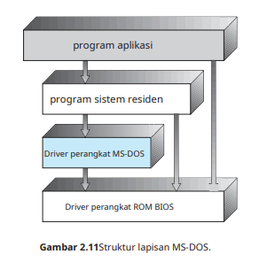
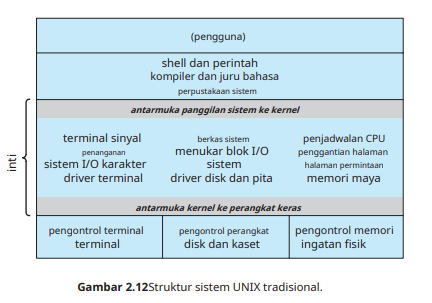
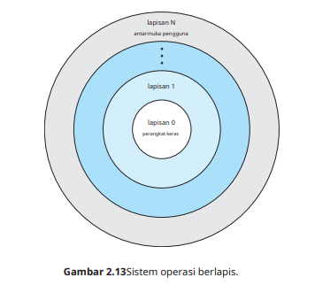
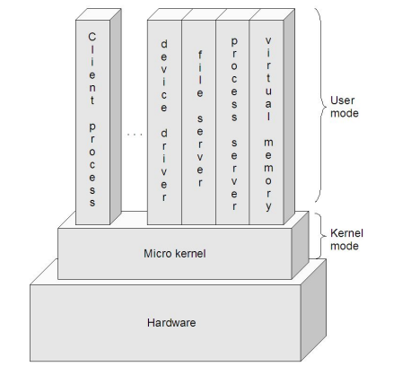

<h1 align="center">STRUKTUR SISTEM OPERASI</h1><br>

## 7.1. PENDAHULUAN

<p align="justify">Suatu sistem operasi modern merupakan suatu sistem yang besar dan kompleks sehingga strukturnya harus dirancang dengan hati-hati dan saksama supaya dapat berfungsi seperti yang diinginkan serta dapat dimodifikasi dengan mudah. Struktur sistem operasi merupakan komponen-komponen sistem operasi yang dihubungkan dan dibentuk di dalam kernel. Ada beberapa struktur sistem operasi dan pernah dicoba, diantaranya sebagai berikut, struktur sederhana, struktur berlapis, dan mikro kernel.</p>

## 7.2. STRUKTUR SEDERHANA ATAU MONOLITHIC

<p align="justify">Struktur sistem operasi di sistem ini tidak terstruktur. Sistem operasi sebagai kumpulan prosedur yang masing-masing dapat saling dipanggil jika dibutuhkan. Setiap prosedur yang ada di dalam sistem ini mempunyai <i>interface</i> yang sudah didefinisikan dengan baik. Dalam hal ini berupa parameter dan hasilnya, serta masing-masing prosedur bebas untuk saling memanggil jika dibutuhkan. Walaupun disebut tidak berstruktur, sebenarnya sistem monilisthic tetap mempunyai struktur
walaupun kecil dan mendasar. Seringkali, sistem seperti itu dimulai sebagai sistem kecil, sederhana, dan terbatas dan kemudian berkembang
melampaui cakupan aslinya.<br><br>
Contoh dari sistem operasi ini adalah <b>bMS-DOS</b> dan <b>UNIX</b>, dengan ciri khas:</p>

<p align="center"></p>

* __MS DOS__ = fokus pada fungsionalitas tertentu dan tidak dapat dibagi dalam beberapa modul.

* __UNIX__ = fokus pada setiap prosedur yang memanggil prosedur lainnya, sehingga menyebabkan tiap prosedur dapat saling berkomunikasi dan kernel berisikan semua layanan yang disediakan oleh sistem ke pengguna.

<p align="center"></p>

<p align="justify">Struktur sistem operasi monolitik hanya dapat digunakan pada beberapa perangkat keras saja. Hal ini disebabkan karena sistem operasi monolitik dilengkapi dengan operasi <i>dual mode</i> dan pelayanan <i>System call</i>. Namun, Intel 8088 tidak dapat menggunakan <i>dual mode</i> sehingga tidak akan ada proteksi pada perangkat keras yan digunakan.<br>Secara umum, <i>system call</i> pada sistem operasi monolitik dibuat dengan cara:</p>

* _User program_ melakukan _trap_ pada kernel
* Instruksi akan berpindah dari _user mode_ ke _monitor mode_
* Kontrol akan berpindah ke sistem operasi dan otomatis akan memeriksa setiap parameter dari pemanggilan tersebut
* Sistem operasi akan menuju ke tabel yang berisikan slot -k yang menujukkan _system call k_
* Setelah selesai, kontrol akan dikembalikan ke _user program_

<p align="justify">Walaupun mudah digunakanm struktur monolitik memiliki kekurangan yang cukup berbahaya, diantaranya:</p>

1. Program-program _malware_ dapat dengan mudah dimodifikasi sistem dan merusak keseluruhan sistem operasi yang digunakan
2. Dapat menyebabkan pemborosan jika setiap kernelnya harus menjalankan kernel monolitik yang sangat besar.
3. Jika satu saja kesalahan pemrograman dari salah satu bagian kernel, dapat menyebabka matinya keseluruhan sistem monolitik yang digunakan.

## 7.3. STRUKTUR BERLAPIS

<p align="justify">Sistem operasi berlapis memiliki beberapa lapis yang beragam, mulai dari bagian atas hingga bagian bawah. Masing-masing lapisan ini memiliki fungsi dan tujuannya tersendiri yang saling mendukung satu sama lain. Lapisan paling bawah digunakan untuk perangkat keras, sedangkan lapisan paling atas digunakan untuk <i>user interface.</i><br></p>

<p align="center"></p>
<p align="center">Gambar Struktur Berlapis</p>

<p align="justify">Suatu sistem dapat dibuat modular dengan banyak cara. Salah satu metodenya adalah pendekatan berlapis, di mana sistem operasi dipecah menjadi beberapa lapisan (level). Lapisan bawah (lapisan 0) adalah perangkat keras; tertinggi (lapisanN) adalah antarmuka pengguna. Struktur layering ini digambarkan pada Gambar 2.13.</p>

<p align="center"></p>

<p align="justify">Sistem berlapis banyak digunakan karena dapat mengurangi kompleksitas rancangan dari implementasi sebuah sistem operasi. Setiap lapisan struktur tersebut berasal dari hasil implementasi objek abstrak. Kondisi ini menyebabkan hasil implementasi berasal dari data yang terenkapsul dan operasu yang dapat dimanipulasi. Salah satu contoh struktur sistem berlapis adalah <i>The System</i>.<br></p>

```
Stallings memberi model yang lebih detail, sebagai berikut:
• Lapisan 1. Berisi berbagai sirkuit elektronik, misal register, memory cells, dan logic gate.
• Lapisan 2. Berisi instruksi prosesor, misal instruksi aritmatika, instruksi transfer data, dsb.
• Lapisan 3. Penambahan konsep seperti prosedur/subrutin, maupun fungsi yang me-return nilai tertentu.
• Lapisan 4. Penambahan interrupt.
• Lapisan 5. Program sebagai sekumpulan instruksi yang dijalankan oleh prosesor.
• Lapisan 6. Berhubungan dengan secondary storage device, yaitu membaca/menulis head, track, dan sektor.
• Lapisan 7. Menciptakan alamat logika untuk proses. Mengatur hubungan antara main memory, virtual memory, dan secondary memory.
• Lapisan 8. Program sebagai sekumpulan instruksi yang dijalankan oleh prosesor.
• Lapisan 9. Berhubungan dengan secondary storage device, yaitu membaca/menulis head,track, dan sektor.
• Lapisan 10. Menciptakan alamat logika untuk proses. Mengatur hubungan antara main memory, virtual memory, dan secondary memory.
• Lapisan 11. Program sebagai sekumpulan instruksi yang dijalankan oleh prosesor.
• Lapisan 12. File adalah objek yang memiliki nama dan ukuran. Abstraksi dari lapisan 9.
• Lapisan 13. Menyediakan interface agar bisa berinteraksi dengan pengguna.
```

<p align="justify">Lapisan-lapisan dari 1-4 bukanlah bagian dari sistem operasi dan masih menjadi bagian dari prosesor secara ekslusif.<br>

Lapisan ke-5 hingga ke-7, sistem operasi sudah berhubungan dengan prosesor.<br>

Selanjutnya dari lapisan ke-8 hingga 13, sistem operasi berhubungan dengan media penyimpanan maupun perlatan-peralatan
lain yang ditancapkan, misalnya peralatan jaringan.</p>

<p align="justify">Keuntungan utama dari pendekatan berlapis adalah kesederhanaan konstruksi dan debugging. Lapisan dipilih sehingga masing-masing menggunakan fungsi (operasi) dan layanan hanya lapisan tingkat yang lebih rendah. Pendekatan ini menyederhanakan debugging dan verifikasi sistem. Lapisan pertama dapat di-debug tanpa memperhatikan
sisa sistem, karena, menurut definisi, hanya menggunakan perangkat keras dasar (yang dianggap benar) untuk mengimplementasikan fungsinya. Setelah lapisan pertama didebug, fungsinya yang benar dapat diasumsikan sementara lapisan kedua di-debug, dan seterusnya. Jika kesalahan ditemukan selama debugging lapisan tertentu, kesalahan harus pada lapisan itu, karena lapisan di bawahnya sudah di-debug. Dengan demikian, desain dan implementasi sistem disederhanakan.</p>

## 7.4. MIKRO KERNEL

<p align="justify">Pada pembahasan "Struktur Sederhana", sempat disinggung istilah "kernel". Apakah kernel itu?<br>
Kernel adalah komponen sentral dari sistem operasi. Ia mengatur hal-hal seperti interrupt handler(untuk menyediakan layanan interupsi), process scheduler(membagi-bagi proses dalam prosesor), memory management, I/O, dan sebagainya. Atau dengan kata lain, ia adalah jembatan antara hardware dengan software.
Cara tradisional untuk membangun sistem operasi adalah dengan membuat kernel monolitik, yaitu semua fungsi disediakan oleh kernel, dan ini menjadikan kernel suatu program yang besar dan kompleks.
Cara yang lebih modern, adalah dengan menggunakan kernel mikro. Kernel mikro adalah sistem operasi yang mempermudah komunikasi, antara program klien dengan beragam layanan pada ruang user. Komunikasi yang terjadi antara <i>module user</i> menggunakan <i>passing massage.</i></p>

<p align="center"></p>
<p align="center">Gambar Struktur Kernel Mikro</p>

<p align="justify">Beberapa sistem operasi yang menerapkan mikro kernel adalah:</p>

* __Tru64 UNIX__
* __MacOSX__
* __QNX__

<p align="justify">Beberapa kelebihan kernel mikro:</p>

1. _*Interface*_ yang seragam. Proses tidak lagi dibedakan, baik antara kernel-level maupun userlevel, karena semuanya berkomunikasi via message passing.
2. _*Extensibility*_. Bisa menambahkan fitur-fitur baru tanpa perlu melakukan kompilasi ulang.
3. _*Flexibility*_. Fitur-fitur yang sudah ada bisa dikurangi, atau dimodifikasi sesuai dengan kebutuhan sehingga menjadi lebih efisien. Misalnya tidak semua pengguna membutuhkan security yang sangat ketat, atau kemampuan untuk melakukan distributed computing.
4. _*Portability*_. Pada kernel mikro, semua atau sebagian besar kode yang prosesor-spesifik berada di dalamnya. Jadi, proses porting ke prosesor lain bisa dilakukan dengan relatif sedikit usaha. Pada kelompok desktop misalnya, tampaknya dominasi Intel makin kuat. Tapi, sampai seberapa lama itu bisa bertahan? Karena itulah, portability adalah salah satu isu yang sangat penting.
5. _*Reliability*_. Semakin besar suatu software, maka tentulah semakin sulit untuk menjamin reliability-nya. Desain dengan pendekatan berlapis sangatlah membantu, dan dengan pendekatan kernel mikro bisa lebih lagi. Kernel mikro dapat dites secara ekstensif .Karena dia menggunakan API yang sedikit, maka bisa meningkatkan kualitas code di luar kernel.
6. _*Support for object-oriendted OS*_. Model kernel mikro sangat sesuai untuk mengembangkan sistem operasi yang berbasis object-oriented. Contoh sistem operasi yang menggunakan kernel mikro adalah MacOS X dan QNX.

<p align="justify">Beberapa manfaat yang didapat dari struktur sistem mikro kernel adalah:</p>

* Mudah untuk dikembangkan
* Mudah untuk porting sistem operasi ke arsitektur baru
* Mudah diandalkan
* Hanya menggunakan sedikit kode
* Lebih aman